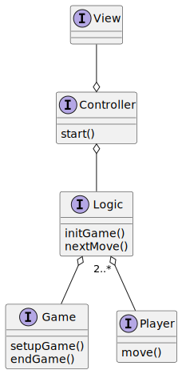

# Design architetturale

## Architettura complessiva

Per garantire una corretta separazione delle responsabilità tra i componenti, il progetto adotta il pattern architetturale _MVC_. Questo approccio permette di mantenere l'architettura il più possibile modulare e flessibile. La separazione dei compiti e dei componenti proposta da _MVC_ favorisce il riuso del codice, un aumento della produttività, facilita la manutenzione del software e ne agevola la scalabilità.

  

## Pattern MVC

Come illustrato nella figura precedente, i componenti sono completamente autonomi tra loro, garantendo una chiara distinzione delle responsabilità tra di essi.

- Il **model** rappresenta il comportamento dell'applicazione in termini del dominio del problema, rimanendo completamente separato dall'interfaccia utente. Esso si occupa della gestione dei dati, della logica e delle regole dell'applicazione.
- Il **controller** è responsabile principalmente dell'implementazione e dell'applicazione della logica di gioco, oltre a gestire l'interazione tra il model e la view.
- La **view** presenta i dati contenuti nel model attraverso una rappresentazione testuale o grafica e gestisce l'interazione tra la logica e gli utenti.
