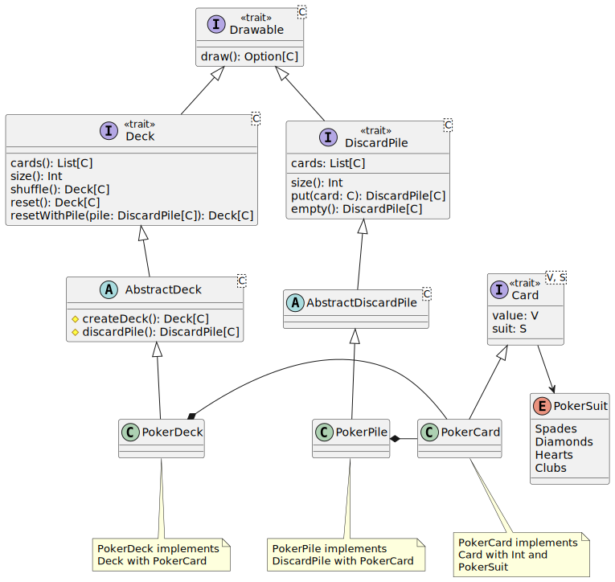

# Design di dettaglio

## Bot e giocatori

Nella [figura](#bot-player-uml) è possibile visionare il diagramma UML relativo alle relazioni tra le classi e le interfacce di player e bot.

### Giocatori

Per far sì che il gioco sia giocabile, sono necessari i giocatori. Alla base di tutto ci sta l'interfaccia `Player`, un trait che rappresenta un giocatore base di qualsiasi gioco di carte. Al suo interno troviamo:
- il _type CardType_, che rappresenta il tipo di carte con il quale il giocatore avrà a che fare durante il gioco.
- _val name_, il nome del giocatore.
- i metodi generici per un qualsiasi giocatore di un qualsiasi gioco di carte:
  - _cards: List[CardType]_: restituisce le carte nella mano del giocatore.
  - _draw(drawable: Drawable[CardType]): Unit_: pesca una carta dal mazzo passato come parametro.
  - _drawCovered(drawable: Drawable[CardType]): Unit_: pesca una carta dal mazzo passato come parametro, ma la carta rimane coperta.
  - _discard(cardIndex: Int): CardType_: scarta una carta dalla mano e la restituisce.
  - _isEqualTo(anotherPlayer: Player): Boolean_: confronta due giocatori e restituisce se sono uguali.

Un'implementazione dell'interfaccia Player specifica per il gioco Cactus è la case class `CactusPlayer`. Il CardType è definito come PokerCard & Coverable e sono implementati i metodi dell'interfaccia `Player` con un'aggiunta di altri due metodi:
- _calledCactus: Boolean_: restituisce se il giocatore ha chiamato cactus.
- _callCactus(): Unit_: permette al giocatore di chiamare cactus.

Questi metodi sono specifici per il gioco Cactus, per questo sono stati inseriti solamente nell'implementazione dell'interfaccia relativa a tale gioco.

### Bot

Per rendere completa l'applicazione erano necessari anche i giocatori avversari al giocatore umano. Per questo è stata creata l'interfaccia `CactusBot`, la quale definisce tutti i metodi necessari ad un bot di Cactus per giocare. La classe `CactusBotImpl` implementa l'interfaccia CactusBot ed estende CactusPlayer, in quanto il bot è nell'effettivo un giocatore di Cactus e i metodi implementati in CactusPlayer sono necessari anche per i CactusBot.

I CactusBot sono pensati per essere più o meno intelligenti a seconda delle impostazioni che l'utente può definire prima della partita. Per questo nell'oggetto `CactusBotData` sono presennti tre enum:
- _enum DrawMethods_: definisce i metodi di pesca delle carte (dal mazzo principale, dalla pila degli scarti, casuale o intelligente in base alla carta in cima alla pila degli scarti).
- _enum DiscardMethods_: definisce i metodi di scarto delle carte in mano (una carta conosciuta, una sconosciuta o casuale).
- _enum Memory(val lossPercentage: Double)_: definisce la memoria (non buona, normale, buona, molto buona o ottima).

Un valore per ciascuno di questi enum viene passato al CactusBot in fase di creazione.

## Carte da gioco e mazzi

Nella [figura](#card-deck-pile-uml) è possibile vedere il diagramma UML relativo alle relazioni tra le carte, il mazzo da gioco e la pila degli scarti.

### Carte

Uno degli elementi alla base dell'applicazione sono le carte, dato che i giochi che potranno essere implementati si basano proprio su queste.
Card è un'interfaccia generica che rappresenta una carta con un valore (V) e un seme (S).

È un trait che definisce le caratteristiche essenziali che ogni carta deve possedere:
- **value**: il valore della carta, il cui tipo è determinato dal generico V.
- **suit**: il seme della carta, il cui tipo è determinato dal generico S.
Questa interfaccia consente la creazione di carte con diverse combinazioni di valori e semi, mantenendo la flessibilità del sistema.

Per fornire maggiore flessibilità, è stata creata un'interfaccia `Coverable`, che fornisce a una carta dei metodi per gestire le azioni di copertura e scopertura di essa.

`PokerSuit` è un'enumerazione che rappresenta i quattro semi delle carte nel gioco del poker. Gli elementi inclusi sono:
- Spades (Picche)
- Diamonds (Quadri)
- Hearts (Cuori)
- Clubs (Fiori)

Questa enumerazione fornisce una rappresentazione standard dei semi nel contesto di un mazzo di carte da poker.

La classe `PokerCard` rappresenta una carta a semi francesi, il cui valore quindi è di tipo intero, mentre il seme è uno tra quelli specificati nell'enumerazione `PokerSuit`.

### Mazzo e pila degli scarti

Il mazzo e la pila degli scarti sono un elemento centrale nell'applicazione, insieme alle carte.
Infatti, oltre a essere presente un mazzo e una pila all'interno di ogni gioco, questi dovranno essere usati anche dai giocatori, in diverse fasi (come per esempio quella di pesca).

Dato che in diversi giochi, un giocatore può pescare sia dal mazzo, che dalla pila degli scarti, è stata pensata un'interfaccia comune che rappresenta un oggetto generico, da cui è possibile pescare delle carte.
Questa interfaccia `Drawable` mette a disposizione un metodo `draw()` che restituisce la prossima carta.
Nello specifico restituisce un valore opzionale, in quanto l'oggetto potrebbe essere esaurito, quindi non disporre più di carte.
`Drawable` è formata da un parametro, che specifica il tipo di carte di cui è composto.

L'interfaccia `Deck` estende da `Drawable` e rappresenta un mazzo generico.
È composta infatti dai metodi:
- _cards(): List[C]_: restituisce la lista di tutte le carte nel mazzo. 
- _size(): Int_: restituisce il numero di carte presenti nel mazzo. 
- _shuffle(): Deck[C]_: mescola le carte nel mazzo, restituendo un nuovo mazzo mescolato. 
- _reset(): Deck[C]_: resetta il mazzo allo stato iniziale. 
- _resetWithPile(pile: DiscardPile[C]): Deck[C]_: resetta il mazzo usando una pila degli scarti.

L'interfaccia `DiscardPile` estende da `Drawable` e rappresenta una pila degli scarti generica.
È composta infatti dai metodi:
- _cards(): List[C]_: restituisce la lista di tutte le carte nella pila di scarto. 
- _size(): Int_: restituisce il numero di carte presenti nella pila di scarto. 
- _put(card: C): DiscardPile[C]_: aggiunge una carta alla pila di scarto, restituendo la pila aggiornata. 
- _empty(): DiscardPile[C]_: svuota la pila di scarto, restituendo una pila vuota.

Le classi astratte `AbstractDeck` e `AbstractDiscardPile` forniscono alcune implementazioni di base e definiscono dei metodi protetti per la gestione interna.
Queste classi sono usate per la creazione di oggetti _mazzo_ e _pila degli scarti_ specifici.

Per quanto riguarda le classi concrete, `PokerDeck` e `PokerPile` rappresentano rispettivamente un mazzo e una pila di scarto, in cui vengono usate delle `PokerCard`.

## Flusso di gioco (Cactus)

Il flusso di gioco è si articola in fasi sequenziali, nelle quali il giocatore può effettuare solo determinate azioni.
Il corretto avanzamento attraverso queste fasi è essenziale per mantenere l'integrità e il ritmo del gioco, garantendo che ogni giocatore segua le regole stabilite e compia le azioni nel momento giusto.

Le fasi principali del gioco sono:
- **Inizio gioco**: prima fase da risolvere, ci si entra solo all'inizio del gioco; dopodiché non viene più acceduta.
In questa fase il giocatore deve scegliere due carte da vedere.
- **Pescare**: il giocatore pesca una carta dal mazzo o dalla pila degli scarti.
- **Scartare una carta**: il giocatore scarta una carta dalla sua mano di gioco.
- **Scartare carte uguali**: i giocatori possono scartare delle carte con lo stesso valore dell'ultima scartata.
- **Chiamare cactus**: il giocatore può chiamare _Cactus_, ponendo fine alla partita.

All'interno del gioco verrà mantenuto un riferimento alla fase corrente.
Questo verrà aggiornato ogni volta che l'azione effettuata in una fase terminerà.
Per esempio, dopo la fase _Pescare_ viene sempre quella di scartare una carta, quindi dopo che il giocatore ne ha pescato una, il riferimento verrà aggiornato direttamente dal metodo associato alla fase _Pescare_.

L'oggetto `Logic`, che gestirà il gioco nella sua componenete più dinamica, metterà a disposizione dei metodi per gestire le interazioni base che il giocatore può effettuare (come per esempio, cliccare il mazzo, la pila degli scarti, una carta della propria mano o un altro giocatore).
Ognuno di questi metodi, dovrà controllare se può essere chiamato nella fase corrente, dato che ognuno di essi sarà associato a un'azione dell'utente.
Quindi se il giocatore clicca sul mazzo, per pescare una carta, verrà chiamato un metodo `draw()`.
All'interno di questo, verrà eseguito l'handler associato all'azione _Pesca_, solo se la fase è _Pescare_; altrimenti la fase non viene aggiornata e si attende che l'utente compia l'azione giusta.

## MVC scalabile per vari giochi

Nella [figura](#mvc-uml) è possibile vedere il diagramma UML relativo alle relazioni tra i componenti del pattern MVC, utilizzati per la realizzazione dell'applicazione.

### MVC

Il pattern architetturale MVC è stato raggiunto con l'aiusilio di un design pattern chiamato **Cake Pattern** (basato su **Component programming**).

Quest'ultimo permette di creare un'architettura modulare e scalabile, in cui i componenti sono facilmente sostituibili e configurabili.
Nel Cake Pattern, i **"component providers"** sono definiti come trait con un valore astratto (simile a un singleton). 
Altri componenti verranno mescolati con i provider, ricevendo automaticamente le dipendenze. 
I provider, l'interfaccia, l'implementazione, i requisiti, ecc., possono quindi essere incollati insieme con facilità.

### Model

`ModelModule` è un'interfaccia generica che rappresenta il modulo di un model.

Il modulo in questione deve possedere un **Provider**, che fornisce un'istanza del model. Inoltre, per essere il più generico possibile, 
quest'ultimo contiene il type alias `ModelType`, che rappresenta il tipo del modello, il quale viene definito dall'implementazione dell'interfaccia.

Inoltre, le classi che implementano `ModelModule` possono possedere un trait `Component`, che contiene le classi, sottotipo di `ModelType`, che possono essere 
istanziate e successivamente fornite dal provider. 

### Controller

`ControllerModule` è un'interfaccia generica che rappresenta il modulo di un controller.

Analogamente a `ModelModule`, sono presenti un **Provider**, che fornisce un'istanza del controller e un type alias `ControllerType`, che rappresenta il tipo del controller.
Le classi che implementano `ControllerModule` possono possedere un tratto `Component` con un funzionamento identico a quello presente nelle implementazioni di `ModelModule`.

In più, nel modulo del controller il type `Requirements` rappresenta le dipendenze che il controller richiede per poter funzionare, senza necessariamente averle già istanziate al prima dell'uso.
Dentro `Component`, l'oggetto **context** fornisce accesso alle dipendenze definite in `Requirements`.

### View

`ViewModule` è un'interfaccia generica che rappresenta il modulo di una view.

La sua struttura è completamente analoga a quella di `ControllerModule`, con la differenza che il type alias `ViewType` rappresenta il tipo della view.

### Composizione dei moduli

L'implementazione di ognuno dei moduli precedentemente descritti contiene un trait `Interface`, il quale è essenziale per utilizzare il Cake Pattern al meglio e
che estende `Provider` e `Component`, i quali rispettivamente forniscono un'istanza del componente e le classi che possono essere istanziate e fornite dal provider.

La classe che ha il compito di unire i moduli estende `Interface` del model, `Interface` del controller e `Interface` della view, inoltre 
istanzia i componenti forniti dai vari provider e definisce eventuali metodi. In questo modo i componenti vengono mescolati 
e le dipendenze vengono ricevute automaticamente.

## Logiche dei giochi

Nella [figura](#game-logic-uml) è possibile vedere il diagramma UML relativo alle relazioni tra le classi e le interfacce che rappresentano le logiche dei giochi.

### Interfacce

Le seguenti interfacce sono state create per definire le logiche dei giochi nel modo più generico e scalabile possibile.

Ogni classe che rappresenterà la logica di un gioco potrà estendere queste interfacce, in base alle proprie esigenze e aggiungere metodi 
specifici per il gioco che deve modellare.

#### GameProvider

`GameProvider` è un'interfaccia che rappresenta un provider di un gioco e fornisce un'istanza di quest'ultimo di tipo `Game`.

#### GameLogic

`GameLogic` estende `GameProvider` e mette a disposizione due metodi per il setup del gioco:
- _setup(nPlayers: Int): Players_: restituisce i giocatori in base al gioco scelto e al numero di giocatori richiesti passato come parametro.
- _setupWithBots(botsParams: BotParamsType): Players_: restituisce i giocatori in base al gioco scelto e alla tupla di parametri dei bot passata come parametro.

#### GameWithTurnPhases

`GameWithTurnPhases` deve venir utilizzato solo se il gioco che si vuole creare è a turni e mette a disposizione i metodi per gestire le fasi del turno di un giocatore:
- _currentPhase: TurnPhase_: restituisce la fase corrente del turno.
- _currentPhase\_=(phase: TurnPhase): Unit_: imposta la fase corrente del turno.

`GameWithTurnPhases` sfrutta gli enum che estendono `TurnPhase` per definire le fasi del turno di un giocatore.

#### Logic

`Logic` è un'interfaccia che rappresenta la logica di un gioco e mette a disposizione i metodi per gestire il flusso di gioco.
Al suo interno troviamo:
- il _type Score_, che rappresenta i punteggi ottenuti al termine del gioco.
- il _type PlayerType_, che rappresenta il tipo dei giocatori del gioco.

I metodi per gestire i giocatori e il susseguirsi dei turni di questi ultimi sono:
- _players: Players_: restituisce i giocatori del gioco.
- _getPlayer(index: Int): PlayerType_: restituisce il giocatore in base all'indice passato come parametro.
- _currentPlayer: PlayerType_: restituisce il giocatore che sta eseguendo il turno corrente.
- _nextPlayer: Player_: passa al giocatore successivo e lo restituisce.

I metodi per gestire il flusso di gioco sono:
- _continue(): Unit_: fa andare avanti il gioco eseguendo azioni differenti in base alla fase del turno nel quale viene chiamato.
- _isGameOver: Boolean_: restituisce se il gioco è finito.
- _calculateScore: Scores_: calcola i punteggi finali dei giocatori e li restituisce.
- _seeCard(cardIndex: Int): Unit_: permette al giocatore di vedere una carta della propria mano.
- _handleGameOver(): Unit_: gestisce il termine del gioco.

[Back to index](../index.md) |
[Previous Chapter](../4-architectural-design/index.md) |
[Next Chapter](../6-implementation/index.md)