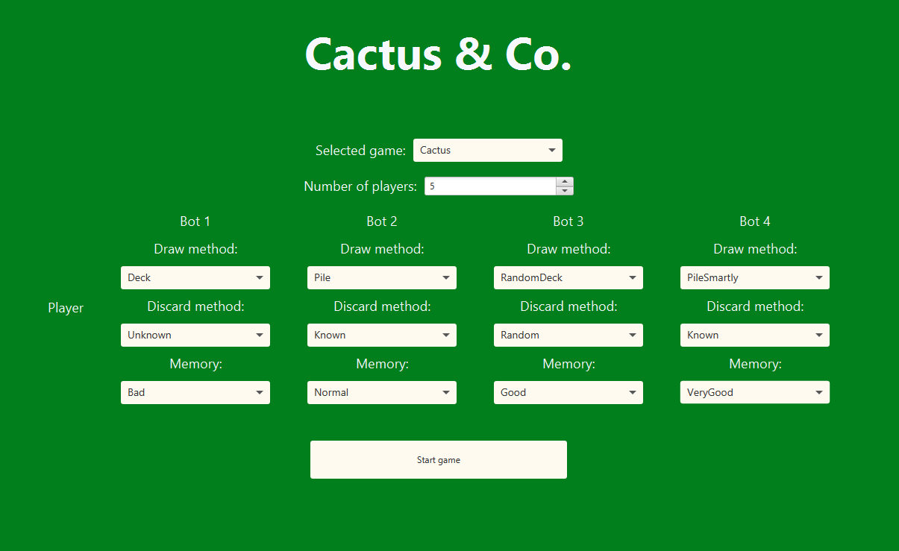

# Guida utente

## Menù principale

All'apertura dell'applicazione ci si trova in un menù. Da questo menù è possibile scegliere il gioco (in questo caso solamente Cactus è implementato) e le impostazioni relative a tale gioco con la quale si vuole proseguire. Dopo aver selezionato il numero di giocatori (compreso tra 2 e 6), è possibile personalizare le impostazioni relative ai bot, partendo dai draw methods:
- **Deck**: il bot pescherà solo dal mazzo.
- **Pile**: il bot pescherà solo dalla pila degli scarti.
- **RandomDeck**: il bot pescherà dal mazzo o dalla pila degli scarti ogni volta in maniera casuale.
- **PileSmartly**: il bot pescherà dalla pila degli scarti se la carta in cima ad essa è una buona carta, altrimenti pescherà dal mazzo.

È possibile impostare anche i discard methods:
- **Unknown**: il bot scarterà una carta scelta casualmente tra quelle che non conosce. Nel caso le conosca tutte applicherà il metodo known.
- **Known**: il bot scarterà la carta di valore più alto tra quelle che conosce. Nel caso non conosca carte, il bot applicherà il metodo unknown.
- **Random**: il bot scarterà una carta scelta casualmente.

Per quanto riguarda la memoria dei bot sono possibili le seguenti impostazioni:
- **Bad**: il bot avrà una pessima memoria e farà fatica a ricordarsi le carte che guarderà.
- **Normal**: il bot avrà il 50% di probabilità di ricordarsi la carta appena vista.
- **Good**: il bot avrà una buona memoria.
- **VeryGood**: il bot avrà una memoria molto buona.
- **Optimal**: il bot avrà una memoria ottima che gli permetterà di ricordarsi tutte le carte che guarderà.

Premendo il pulsante Start game inizierà il gioco.

## Gioco Cactus

La schermata del gioco Cactus è suddivisa in due parti:
- la parte più grande comprensiva del tavolo di gioco.
- la parte più piccola sulla destra comprensiva della fase di gioco corrente con relativa spiegazione e 3 pulsanti:
  - **Tutorial**: apre una schermata sopra alla schermata attuale con il tutorial del gioco.
  - **Continue**: passa alla fase successiva.
  - **Cactus**: chiama cactus.

Il tavolo di gioco presenta i giocatori disposti nel perimetro della schermata e al centro il mazzo con alla sua destra la pila degli scarti, inzialmente vuota (e quindi non visibile).
Per ogni giocatore viene visualizzato:
- Il nome: _Player_ per l'utente e _Bot-n_ per l'ennesimo bot.
- L'indicatore di turno: verde se è il turno del giocatore, rosso altrimenti.
- Il numero di carte in mano.

Per pescare una carta sarà sufficiente cliccare sul mazzo o sulla pila degli scarti (se presente) e la carta apparirà tra le carte nella propria mano di gioco.
Per scartare una carta sarà sufficiente cliccarci sopra e la carta finirà scoperta sulla cima della pila degli scarti.

Se la carta scartata ha un effetto speciale, questo deve essere applicato.
Gli effetti speciali attualmente implementati sono:
- **Jack**: l'utente può guardare una delle sue carte.
- **Asso**: l'utente seleziona un giocatore (che non sia lui stesso) e gli fa pescare una carta dal mazzo.

Durante la fase _Call cactus_ l'utente potrà decidere di chiamare "Cactus".
Le sue carte verranno scoperte e sarà fuori dal gioco, per l'ultimo turno (gli altri giocatori non potranno quindi applicare degli effetti contro di lui).
Gli altri giocatori continuano a giocare per un ulteriore turno e alla fine di esso la partita terminerà, mostrando tutte le carte dei giocatori.
Successivamente l'utente sarà portato in una schermata in cui verrà visualizzata la classifica finale (con il punteggio per ogni giocatore).

Nella schermata dei punteggi saranno presenti due pulsanti, uno per uscire dal gioco e uno per tornare al menù.

[Back to index](../index.md) |
[Previous Chapter](../8-conclusion/index.md)
